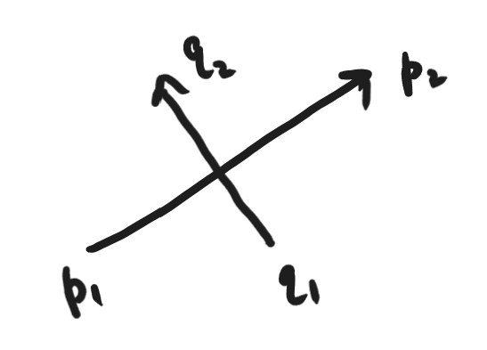
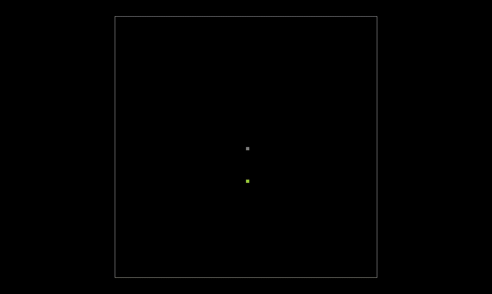
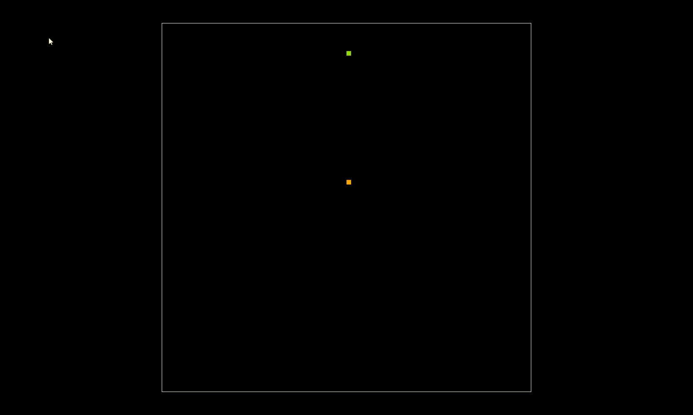
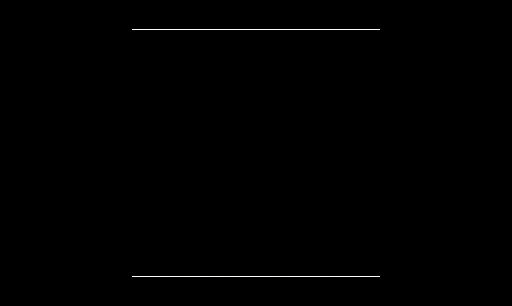
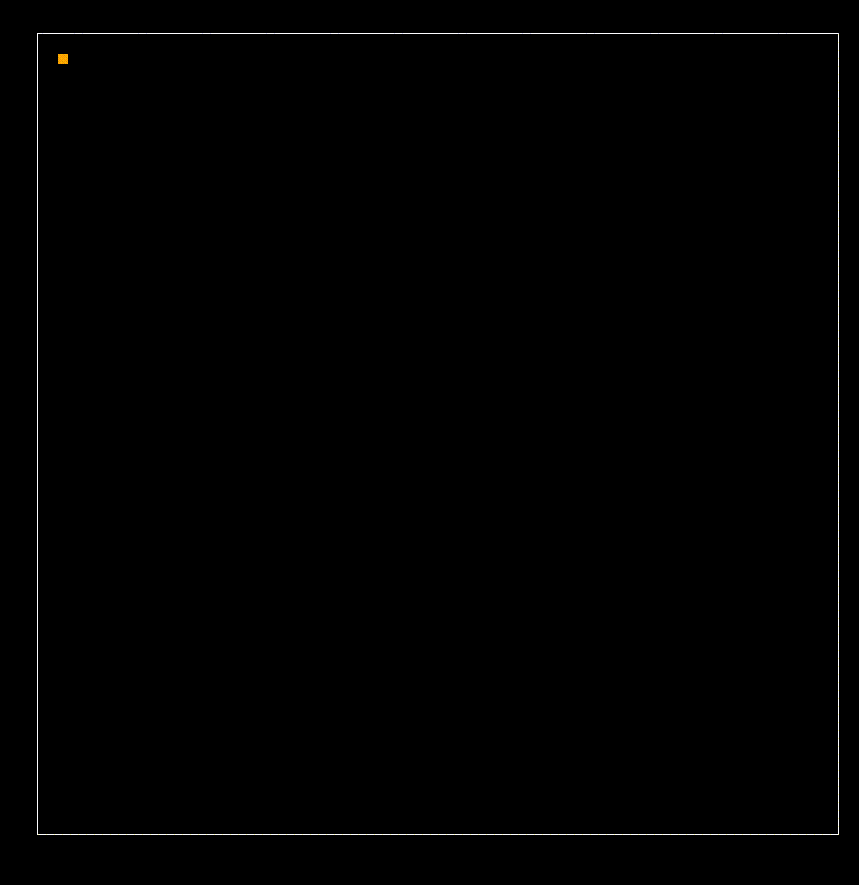
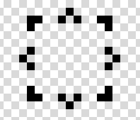

# Odd-even

This is an over-engineered peice of art. Its a simple browser based 2 player game that has the following rules.

## Rules

1. If you are orange you are in team even, blue is team odd.
2. Move your player's dot by moving your cursor.
3. There will be pickups on screen that you can go to and get 1 bullet from them. You can shoot them immediately, or hold them for as long as you want.
4. To shoot a bullet, click. Once shot the bullet will bounce around forever unless they hit a player.
5. If the screen has odd number of bullets, they can all harm the even player, the odd player is invincible. If the bullets are even, the opposite.
6. The probability of the pickup appearing near you is inversely propotional to how many bullets you hold.
7. Once each player holds more than 5 bullets, pickups stop spawning.

## And then god said, let there be WASM!

Now at this point you must be wondering, this is simple, pick one of the million 2D js physics frameworks, and go to town, it can be done in a day! Thats where you were wrong. You expected me not to have a need at an atomic level to prove myself as the smartest person in the room. And as the smartest person in the room, I know JS is too high level.

For the un-initiated, WASM is a binary instruction format for a stack-based virtual machine.Ofcourse I totally understand what that means, but in a nutshell, it lets you call C++ from JS and flex on frontend plebs.

Now I hear you say, ok fine, go low level for some reason, pick Bevy or the thousand other RUST/GO/C++ game engines that target WASM. Here is where you are wrong again. That is what a smart person in the room would do. You are forgetting, I am the smartest. To hell with you and your speed to market. We will write this is C++, and from SCRATCH (🎶dun dun daaa🎶).

## Some more rules

1. For simplicity the playing feild will be 800px by 800px
2. It will be divided into cells of 10px by 10px (so 80 cells by 80 cells)
3. Each object will be exactly one pixel, ofcourse I can figure out the complex physics of multi-cell rigid body, but I dont want to 😤

# Physics

## Basic Movement

The basic movement in a C++ class called `physics::Entity`. It has the following function to update the velocity vector, acc vector, position vector based on force:

```C++
  void compute_position() {
    this->acceleration.x = this->force.x / this->mass;
    this->acceleration.y = this->force.y / this->mass;
    this->velocity.x += this->acceleration.x;
    this->velocity.y += this->acceleration.y;
    this->position.x += this->velocity.x;
    this->position.y += this->velocity.y;
  }
```

Every n ms every entities compute position is called, and their position is update! n is dependent on JS, which calls the C++ function responsible for updating all the entities positions. Every time the positions are updated its called a `tick`.

### A Spring!

The player entity will follow the cursor of the user. But I don't want the user to be able to stand in one place and avoid all the bullets. So to create chaos, the player entity will follow a spring motion around the cursor. The spring is interesting because:

1. Its smart! Only a smart person can figure out how to multiply a constant with a difference of 2 position vectors. And I can brag!
2. Its not as smart as a pendulum so it won't make me feel dumb. Winning. :)

Now spring is simple. Set a origin and at every `tick` update the entities force with: `k * (position - origin)`.

Some good old fashioned inheritence:

```C++
class Spring : public Entity {
  private:
  Vector origin;
  double k;

  public:
  Spring(Vector origin, double k) {
      this->origin = origin;
      this->k = k;
  }

  Vector get_force(Vector position) {
      Vector displacement = position - origin;
      return displacement * -k;
  }

  void tick() {
      update_force(get_force(get_position()));

      this->compute_position();
  }
};
```

So far, so good:


## Collisions

### Detections

The interesting thing about this setup is that updates to position can happen with mutliple steps within a tick. This means: P and Q can move like this: from p1 to p2 and q1 to q2.



So if we just compare exact cell positions to detect collisions, we will never detect any b/w P and Q. So we need to improvise. Thankfully what we can do is make a list of position before and after the tick and use line segments between old and new position and see if any intersect! Is there a better way? Probably, but I won't google it, ofc mine is the best solution. What do you mean arrogance?

Some basic algebra is needed to detect the intersection of the two update vectors:

#### Two point formula of a line:

Given a line going through $(x_1, y_1)$ and $(x_2, y_2)$ the two point formula of a line is:
$\frac{(y - y_1)}{(x - x_1)} = \frac{(y_2 - y_1)}{(x_2 - x_1)}$ so $$\frac{(y - y_1)}{(x - x_1)} - \frac{(y_2 - y_1)}{(x_2 - x_1)} = 0$$ (basically the slope b/w the two points will always be equal to the slope b/w any other two points).

#### Do two points lie on the same side of a line?

Given two arbitary points $(x_a, y_a)$ and $(x_b, y_b)$ they lie on the same side of the line if and only if:
$$\frac{(y_a - y_1)}{(x_a - x_1)} - \frac{(y_2 - y_1)}{(x_2 - x_1)},  \frac{(y_b - y_1)}{(x_b - x_1)} - \frac{(y_2 - y_1)}{(x_2 - x_1)}$$
have the same sign.

So now we just need to check if the old and new position of the entity we are checking lies on the same side of the old and new position entity we are checking against.

#### Then god said, f\*\*\* u, have an edge case.

I tried making it work for this:


and it always returns collided. Why is that, lets revisit the line thingy if one of the objects is static:


In all three cases, p is on the line that connects $q_1$ and $q_2$, so we actually need four cases:

1. If $p$ and $q$ are both moving but along the same line
2. If $p$ and $q$ are both moving but along different lines
3. If one of $p$ and $q$ is moving, one is static.
4. If both $p$ and $q$ are static.

In 2 our method works, for 1 it has collided if both one of the position points are b/w the position points of the other one. For 3 it has collided if the static one lies on the same line and it is b/w the position updates of the one moving. For 4, only collided if both positions are the same.

And, well it works (atleast for case 3, remember kids, its not testing in production, its distributed and decentralised edge testing.)



### Elastic Collisions

We will assume that all collisions are perfectly elastic. So that simplifies things, not that I can't figure out dampnings and whatnots, ofc I can, but I rather not.

During elastic collisions 2 things are conserved: total momentum and total kinetic energy. We can just google the final equation lol. So when 2 items $a$, $b$ collide with a velocity of $v_a$ and $v_b$ the new velocities $v_a^1$ and $v_b^1$ are:

$$
v_a^1 = \frac{m_a - m_b}{m_a + m_b}*v_a + \frac{2m_b}{m_a + m_b}*v_b
$$

$$
v_b^1 = \frac{m_a - m_b}{m_a + m_b}*v_b + \frac{2m_a}{m_a + m_b}*v_a
$$

And easy peezy:


Wait, thats not right.

After scratching my head, I realised that my ticking function is broken, I detect collision and change the velocity after the objects have gone through each other, then they go back, and collide again, getting stuck in a loop. I need to break ticking into proposed position update and position updates, then before they collide I change their velocity. Over-engineered? WHAT EVEN DO YOU MEAN? I will die before I learn better way to do things than the first instinct I have, good day to you sir!

Ok, I patched it up by keeping a map of all the collisions, and ignoring collisions that happen b/w two objects that collided within the last 2 ticks. Will this create edge case? Ofcourse, but that is future me's problem, and I really don't care about that guy. Screw him, it works! Yay!



## Problems

As any one who has ever worked with me, or if you read the above section and have 2 working brain cell, can guess, I made this way too complicated. And it doesn't work. AT ALL.


Like wtf is even this? This is so broken its not even funny.

I procastinated fixing this for 4 days, and then today realised that I have been missing something fundamental. Time! (somewhere christopher nolan has suddenly started paying attention.)

See in the tick loop:

```c++
void compute_position() {
  this->last_position.x = this->position.x;
  this->last_position.y = this->position.y;

  this->acceleration.x = this->force.x / this->mass;
  this->acceleration.y = this->force.y / this->mass;
  this->velocity.x += this->acceleration.x;
  this->velocity.y += this->acceleration.y;
  this->position.x += this->velocity.x;
  this->position.y += this->velocity.y;
  this->bound_collisions();
}
```

This just assumes that one tick means the exact same everytime, and also that one tick is the exact unit of the velocity and force values. But that is not true. If you have ever used JavaScript you know no timer in JS is accurate. Ever. If the user keeps your tab in the background and their device is not connected to a charger, the 30ms `setInterval` will bloat to few seconds in the worse case.

So how do we fix this and the collision overengineering?

1. A tick must be 1ms always, if tick is called after 45ms, we will internally call tick 45 times.
2. In one tick, a box must not move more than 1 cell, hence velocity has a upper cap of 1000 cell/sec.

Since we have 2, we can delete the BS code of checking if the vectors overlap, and just say collided if the two boxes are in the same cell!

And deleting 100 lines later:


## Player

The player will follow the mouse, as a spring as defined before, but to ensure the player doesn't keep oscillating we need damping! It seems straight forward, damping is just a force propotional to the velocity of the object, but in the opposite direction. `auto damping_force = this->get_velocity() * -1. * damping;` and done!



## Bullet

When the player clicks, a bullet needs to be fired in the direction of the click.


If the user clicks at C, and the player is at P, the bullet should have a velocity in the direction of $C - p$. But if we just set the velocity of bullet to $C - p$, the further the player is from the click, the faster the bullet, we don't want that.

Our friend polar coordinate come into play:


So:

$$v_y = r * sin(\beta) = r * \frac{(C_y - p_y)}{H}$$

$$v_x = r * cos(\beta) = r * \frac{(C_x - p_x)}{H}$$

$$H = \sqrt([C_y - p_y]^2 + [C_x - p_x]^2)$$

And voila!


## 2D graphics

The problem right now is that the player looks bad. Its just a dot. I sketched this player:



I know I wrote this as a rule:

> 3. Each object will be exactly one pixel, ofcourse I can figure out the complex physics of multi-cell rigid body, but I dont want to 😤

But fuck that rule. We will do this.

The player is 8 different shapes, depending on where it is pointed. The player is the origin, and it must point towards the cursor. So the angle is:

$$v = v_c - v_p$$


where $v_c$ is the point where cursor is and $v_p$ is the player. Since:

$$v_c = \langle x_c, y_c \rangle$$
and
$$v_p = \langle x_p, y_p \rangle$$

so the angle $\theta$ is:

$$\theta = tan^{-1}(\frac{y_c - y_p}{x_c - x_p})$$

In C++:

```C++
double get_angle() const {
  auto position = this->get_position();
  auto origin = this->get_origin();
  // we want the player to be origin, and the position to be the cursor
  // we also invert the y axis to match the screen coordinates
  auto radians = std::atan2(-1.*(origin.y - position.y), origin.x - position.x);
  auto angle = radians * 180. / M_PI;
  if(angle < 0) angle += 360.;
  return angle;
}
```

Then we can just draw the player as a left tail and a right tail. Not the most elegant, but, hey, it works, and the bare minimum is all we want.

```C++
physics::Direction get_direction() const {
    auto angle = this->get_angle();
    if(angle < 22.5 || angle > 360. -22.5) // EAST
        return physics::Direction::EAST;
    if(angle < 67.5 && angle > 22.5) // NORTH-EAST
        return physics::Direction::NORTH_EAST;
    if(angle < 112.5 && angle > 67.5) // NORTH
        return physics::Direction::NORTH;
    if(angle < 157.5 && angle > 112.5) // NORTH-WEST
        return physics::Direction::NORTH_WEST;
    if(angle < 202.5 && angle > 157.5) // WEST
        return physics::Direction::WEST;
    if(angle < 247.5 && angle > 202.5) // SOUTH-WEST
        return physics::Direction::SOUTH_WEST;
    if(angle < 292.5 && angle > 247.5) // SOUTH
        return physics::Direction::SOUTH;
    if(angle < 337.5 && angle > 292.5) // SOUTH-EAST
        return physics::Direction::SOUTH_EAST;
    return physics::Direction::NORTH;
}

physics::Vector left_tail_position(const physics::Direction direction, const physics::Vector& position) const {
    switch(direction) {
        case physics::Direction::EAST:       return position + physics::Vector(-1., -1.);
        case physics::Direction::NORTH_EAST: return position + physics::Vector(-1., 0.);
        case physics::Direction::NORTH:      return position + physics::Vector(-1., 1.);
        case physics::Direction::NORTH_WEST: return position + physics::Vector(0., 1.);
        case physics::Direction::WEST:       return position + physics::Vector(1., 1.);
        case physics::Direction::SOUTH_WEST: return position + physics::Vector(1., 0.);
        case physics::Direction::SOUTH:      return position + physics::Vector(1., -1.);
        case physics::Direction::SOUTH_EAST: return position + physics::Vector(0., -1.);
        default:                             return position + physics::Vector(-1., 1.);
    }
}

physics::Vector right_tail_position(const physics::Direction direction, const physics::Vector& position) const {
  switch(direction) {
      case physics::Direction::EAST:       return position + physics::Vector(-1., 1.);
      case physics::Direction::NORTH_EAST: return position + physics::Vector(0., 1.);
      case physics::Direction::NORTH:      return position + physics::Vector(1., 1.);
      case physics::Direction::NORTH_WEST: return position + physics::Vector(1., 0.);
      case physics::Direction::WEST:       return position + physics::Vector(1., -1.);
      case physics::Direction::SOUTH_WEST: return position + physics::Vector(0., -1.);
      case physics::Direction::SOUTH:      return position + physics::Vector(-1., -1.);
      case physics::Direction::SOUTH_EAST: return position + physics::Vector(-1., 0.);
      default:                             return position + physics::Vector(1., 1.);
  }
}
```

Keeping the player static to test, we can see it works!


Now adding back the movement:


Neat.

# Animation

I want the bullets to be acquired by pickup. So naturally I want a pickup collision animation. I drew this simple 4 frame animation:


The top is the default/static state. So seems simple, I just hardcoded all the values:

```C++
void increment_animation_frame() {
  //this makes sure that the animation takes 800ms to complete.
  if((this->current_time - this->last_animation_frame_time) >= 200.) {
      this->frame++;
      this->last_animation_frame_time = this->current_time;
  }
}

void draw_animation_first_frame(std::vector<uint8_t>& graphics, const physics::Vector& position) {
  const auto color = graphics::GREEN;
  graphics[(int)position.x + (int)position.y * 80] = color.to_color_u8();
  this->increment_animation_frame();
  return;
}

void draw_animation_second_frame(std::vector<uint8_t>& graphics, const physics::Vector& position) {
  const auto color = graphics::GREEN;
  graphics[(int)position.x - 1 + (int)(position.y - 1) * 80] = color.to_color_u8();
  graphics[(int)position.x + 1 + (int)(position.y - 1) * 80] = color.to_color_u8();
  graphics[(int)position.x + 1 + (int)(position.y + 1) * 80] = color.to_color_u8();
  graphics[(int)position.x - 1 + (int)(position.y + 1) * 80] = color.to_color_u8();
  this->increment_animation_frame();
  return;
}

void draw_animation_third_frame(std::vector<uint8_t>& graphics, const physics::Vector& position) {
  const auto color = graphics::GREEN;
  graphics[(int)position.x - 1 + (int)(position.y - 1) * 80] = color.to_color_u8();
  graphics[(int)position.x + 1 + (int)(position.y - 1) * 80] = color.to_color_u8();
  graphics[(int)position.x + 1 + (int)(position.y + 1) * 80] = color.to_color_u8();
  graphics[(int)position.x - 1 + (int)(position.y + 1) * 80] = color.to_color_u8();
  graphics[(int)position.x - 2 + (int)(position.y - 2) * 80] = color.to_color_u8();
  graphics[(int)position.x + 2 + (int)(position.y - 2) * 80] = color.to_color_u8();
  graphics[(int)position.x + 2 + (int)(position.y + 2) * 80] = color.to_color_u8();
  graphics[(int)position.x - 2 + (int)(position.y + 2) * 80] = color.to_color_u8();
  this->increment_animation_frame();
  return;
}

void draw_animation_fourth_frame(std::vector<uint8_t>& graphics, const physics::Vector& position) {
  const auto color = graphics::GREEN;
  graphics[(int)position.x - 2 + (int)(position.y - 2) * 80] = color.to_color_u8();
  graphics[(int)position.x + 2 + (int)(position.y - 2) * 80] = color.to_color_u8();
  graphics[(int)position.x + 2 + (int)(position.y + 2) * 80] = color.to_color_u8();
  graphics[(int)position.x - 2 + (int)(position.y + 2) * 80] = color.to_color_u8();
  this->increment_animation_frame();
  return;
}

void draw_self(std::vector<uint8_t>& graphics) override {
  const auto position = this->get_position();
  const auto color = graphics::GREEN;
  if (position.x < 0 || position.x >= 80 || position.y < 0 || position.y >= 80) {
      return;
  }
  // printf("Pickup Position: (%f, %f)\n", position.x, position.y);
  if(this->frame == 0) {
      graphics[(int)position.x + (int)position.y * 80] = color.to_color_u8();
      graphics[(int)position.x + 1 + (int)position.y * 80] = color.to_color_u8();
      graphics[(int)position.x - 1 + (int)position.y * 80] = color.to_color_u8();

      graphics[(int)position.x + (int)(position.y + 1) * 80] = color.to_color_u8();
      graphics[(int)position.x + (int)(position.y - 1) * 80] = color.to_color_u8();
  }
  if(this->frame == 1) {
      this->draw_animation_first_frame(graphics, position);
  }
  if(this->frame == 2) {
      this->draw_animation_second_frame(graphics, position);
  }
  if(this->frame == 3) {
      this->draw_animation_third_frame(graphics, position);
  }
  if(this->frame == 4) {
      this->draw_animation_fourth_frame(graphics, position);
  }
  return;
}
```

and when it collides, the animation is kicked off via the `on_collision` callback of entity:

```C++
void on_collision(physics::Entity* e) {        
  if(this->frame != 0) return;

  printf("Pickup was picked up by %s\n", e->entity_type.c_str());
  this->increment_animation_frame();
}
```
Not the prettiest code in the world, but hey, it works!


Will probably need to rework this, because honestly, even for me, this is ass quality code. But thats for future me. Fuck future me.


# 2D collisions

See the problem right now is that the player is a lot bigger than one point and the pickup is too. But they only react if the top of the player hits the center of the pickup. Which sucks. You have to fly by the pickup mutliple times to hit it at the exact right spot, this is bad.


Well, we will need to figure out 2D collisions. Damn it. Ok, so the math says that this is the updated velocities of 2 circles after collision:

**1. Unit Normal Vector ($n$):**

$$n = \frac{x_1 - x_2}{|x_1 - x_2|}$$

**2. Relative Velocity Normal Component ($v_{rel}$):**

$$v_{rel} = \frac{(v_2 - v_1) \cdot n}{n}$$

**3. New Velocities:**

1. $$v_1' = v_1 + \frac{2m_2}{m_1 + m_2} ((v_2 - v_1) \cdot n)n$$

2. $$v_2' = v_2 + \frac{2m_1}{m_1 + m_2} ((v_1 - v_2) \cdot n)n$$

Thats too complicated for my whee little brain. So I cheated. I detect the collision by checking if the distance between circles is smaller than the sum of their radii (radiuses? radie? radies? idk.).

```C++
auto distance_bw_centers = this->position - other->position;
auto radius_sum = this->radius + other->radius;
bool did_collide = distance_bw_centers.get_magnitude() <= radius_sum;
```

But I left the reaction to the collision the same. I can't be bothered, specially because most of the collisions will be between bullets, that stay unchanged, when the player hits a pickup, it's momentum must not change, since pickup is of mass = 0. So ¯\_(ツ)_/¯.


